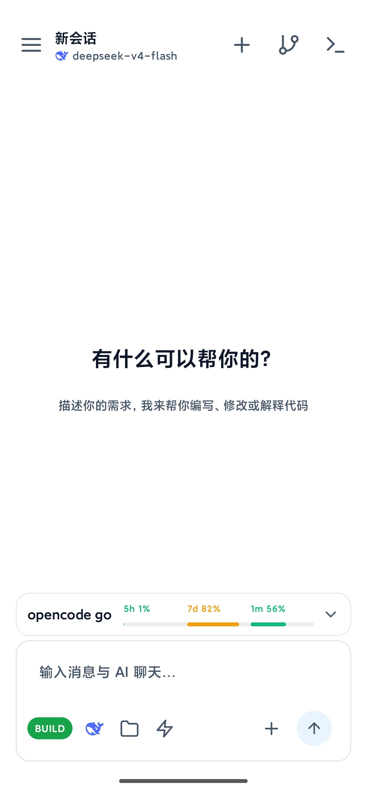
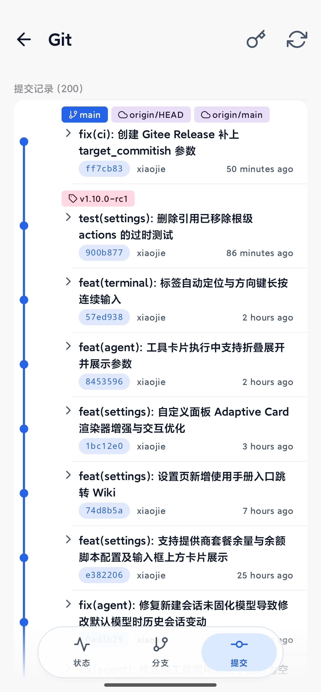
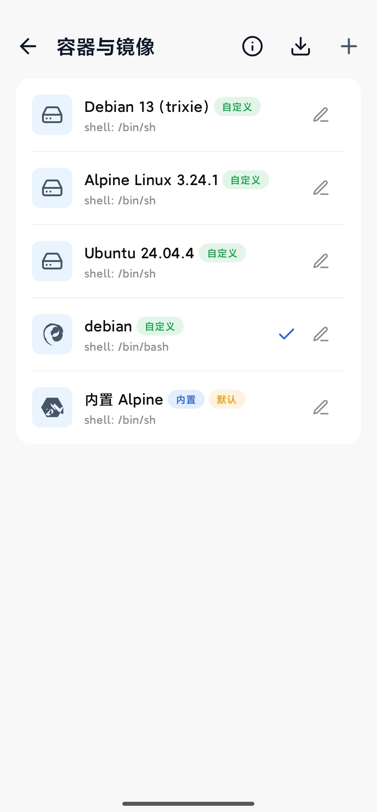
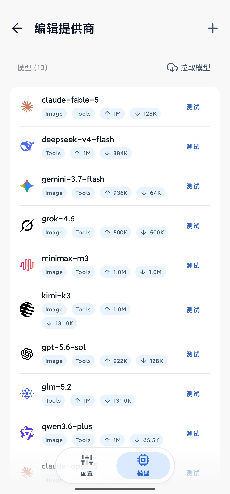

  <h1 align="center">AiCode</h1>
  

    AI-powered coding assistant for Android · Built-in Linux terminal · AI Agent · MCP · Git integration
     
    <a href="README.md">中文</a> · <a href="README.en.md">English</a>
  

  
  
  
  
  
  
  

  <table>
    <tr>
      <td align="center"></td>
      <td align="center"></td>
    </tr>
    <tr>
      <td align="center">Home · AI Chat</td>
      <td align="center">Git · Commit History</td>
    </tr>
    <tr>
      <td align="center"></td>
      <td align="center"></td>
    </tr>
    <tr>
      <td align="center">Container · Image Manager</td>
      <td align="center">Models · Provider List</td>
    </tr>
  </table>

---

## Overview

AiCode is an AI-powered coding assistant that runs natively on Android. It integrates large language models with a local Linux development environment. The built-in Alpine Linux container and terminal emulator let the AI directly read/write files, execute shell commands, and run build tools. It also supports remote SSH servers as the execution backend, turning your phone into a mobile workstation for remote projects.

## Advertisement

| Icon | Description |
|------|-------------|
|  | **[OpenCode Go](https://opencode.ai/go?ref=8Q5GA5B1NY)** — Low-cost subscription with generous limits and reliable access to the most capable open-source models |
|  | **[RainYun](https://www.rainyun.com/logins_)** — Cost-effective cloud servers, new user discounts |

## Features

- **AI Agent** — Supports OpenAI / Anthropic / Gemini compatible protocols with multiple providers; built-in tools for file read/write, shell execution, background terminal, code & web search, image recognition, asking the user, etc.; streaming output with automatic context compression for long conversations
- **Checkpoints & Undo** — File snapshots are recorded before the agent modifies code; one-tap rollback from the conversation, restoring code, chat history, or both
- **Built-in Terminal & Container** — A local Linux container built on Termux components and PRoot with a built-in Alpine image; supports importing custom rootfs images and mounting host directories; terminals can run in the background
- **Remote SSH Mode** — Use a remote server as the execution backend: commands via exec channel, files via SFTP, terminal via shell channel — operate on remote projects directly from your phone
- **MCP Protocol** — Connect to local (stdio) or remote (HTTP) MCP servers to dynamically extend AI tool capabilities
- **Skills & Auto Memory** — Global/project-level skills and long-term memory let the AI reuse experience and conventions across sessions
- **Git Integration** — Built-in Git status, branches, commits, diffs and tag management, with sign-off and credential configuration
- **Workspace Sync** — SFTP / FTP synchronization with a built-in FTP server for desktop file management
- **Backup & Restore** — Encrypted export/import of provider configs, credentials, chat history and workspace files
- **Markdown Rendering** — Real-time Markdown rendering with code highlighting
- **Custom Prompts** — System prompts can be overridden by the user and survive app upgrades

## Getting Started

| Item | Description |
|------|-------------|
| System requirements | Android 8.0+ (API 26), arm64-v8a / x86_64 |
| Download | [GitHub Releases](https://github.com/jieapi/aicode/releases/latest): pick `armsolo` for real devices, `x86solo` for emulators, `universal` for both |
| Quick start | Settings → AI Providers to add a model → Container & Image to pick local or SSH → new session and chat |
| Changelog | [Releases](https://github.com/jieapi/aicode/releases) (all versions & notes) |
| User guide | [GitHub Wiki](https://github.com/jieapi/aicode/wiki) |

## Star

If AiCode is helpful to you, give it a [Star](https://github.com/jieapi/aicode) — it helps more developers discover the project.

## Feedback & Contribution

- **Bug reports**: open an [Issue](https://github.com/jieapi/aicode/issues) with reproduction steps, device model and OS version
- **Feature requests**: discuss your ideas in [Issues](https://github.com/jieapi/aicode/issues) first
- **Contributing**: pull requests are welcome via [Pull Requests](https://github.com/jieapi/aicode/pulls)

## Acknowledgements

- [OpenCode](https://github.com/anomalyco/opencode) — Terminal-based AI coding tool, the core inspiration for this project
- [Termux](https://github.com/termux/termux-app) — Android terminal emulator, provided terminal components and PRoot solution
- [Kelivo](https://github.com/Chevey339/kelivo) — Cross-platform LLM chat client, AI conversation UI design reference

## License

This project is licensed under [GPL-3.0](LICENSE).
